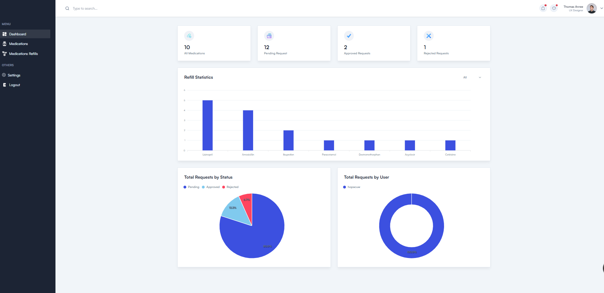
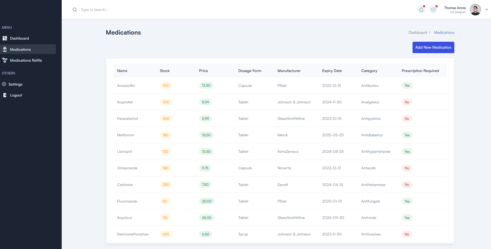
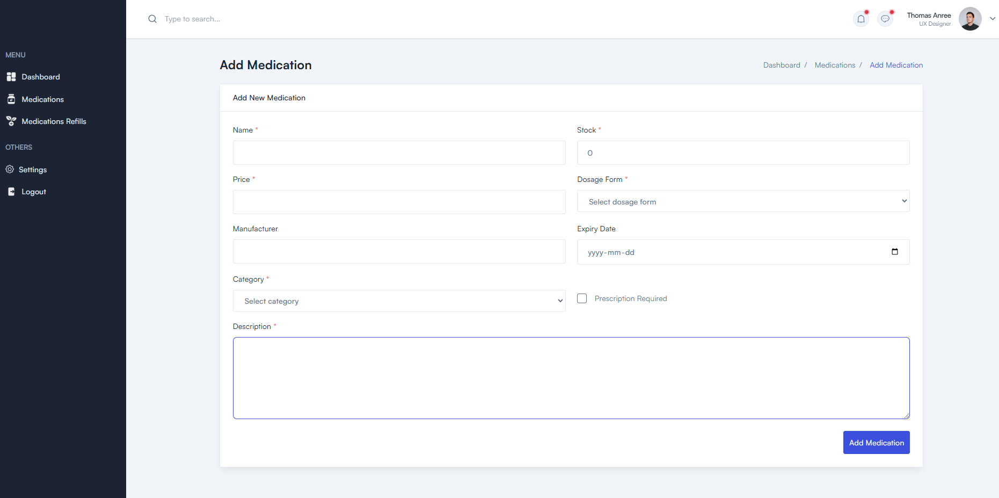
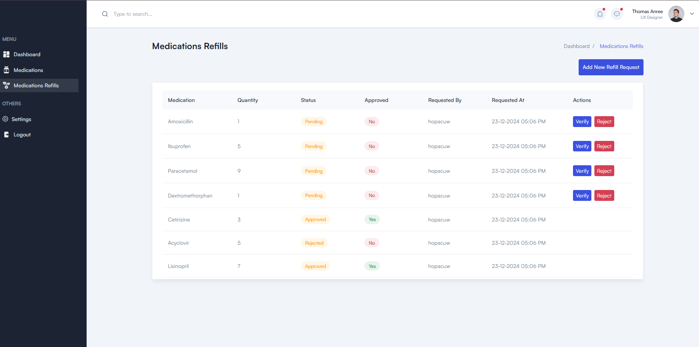
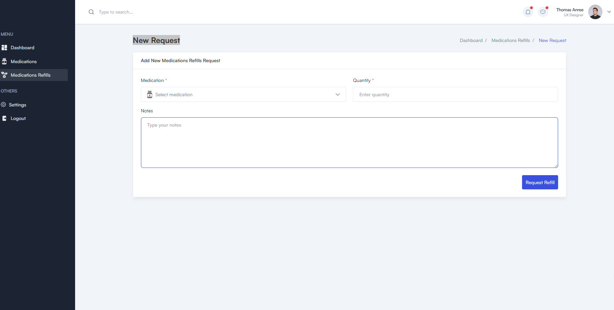

# Pyramids Pharmacy Management System

## Overview

Pyramids Pharmacy Management System is a web application designed to streamline the management of pharmacy operations. The platform includes features such as medication management, refill requests, and user role-based functionalities to ensure efficient and secure operations.

## Features

1. **Authentication**

   - Register: Allows users to create an account.
   - Login: Enables users to securely log into the system.

2. **Dashboard**

   - Provides a summary of key statistics:
     - All Medications: Displays the total count of medications available in the system.
     - Pending Requests: Shows the number of refill requests awaiting approval.
     - Approved Requests: Can approve the number of refill requests that have been approved.
     - Rejected Requests: Displays the number of refill requests that have been rejected.  

3. **Medications Module**

   - Add New Medication: Users can add new medications to the system.
   - List All Medications: View a comprehensive list of all medications.

4. **Medications Refills**

    - Add Refill Request: Users can submit a refill request for medications.
    - List All Requests: View all submitted refill requests.
    - Verify Request: You can verify refill requests (planned to make it available for higher-role users only).
    - Reject Request: You can reject refill requests (planned to make it available for higher-role users only).

## Future Enhancements

- Add user roles and permissions to restrict access to certain features based on user roles.
- Role-based access control to handle verification and rejection of refill requests.
- Improved analytics and reporting on medication usage and refill trends.
- Integration with third-party APIs for inventory management and supply chain optimization.
- Add Medication based on expiration date and alert the user when the medication is about to expire.
- Add a feature to alert the user when the medication is about to finish.
- Add a feature to alert the user when the medication is out of stock.

## Screenshots

### Authentication Pages


### Dashboard


### Medications Module



### Refill Requests




## Prerequisites

- Docker
- Docker Compose

## Technologies Used

- Django REST Framework
- React
- PostgreSQL
- Docker
- Docker Compose
- ApexCharts
- Tailwind CSS
- Vite
- Axios

## Installation

Follow these steps to set up and run the project:

### 1. Clone the Repository

```sh
git clone https://github.com/EsraaRMashaal/PyramidsPharmacy.git
cd PyramidsPharmacy
```

### 2. Set Up the Environment Variables

Create a `.env` file in the root directory and add the following environment variables
    
```sh   

    DEBUG=True
    DB_NAME=pyramids-pharmacy
    DB_USER=postgres
    DB_PASSWORD=postgre_2023
    DB_HOST=host.docker.internal
    DB_PORT=5432

    VITE_API_BASE_URL=http://127.0.0.1:8000/api
```

### 3. Build and Run the Docker Containers
    
```sh
docker-compose up --build
```

### 4. Access the Application in Your Browser

- Frontend: Open your web browser and navigate to http://localhost:5173/.
- Backend: Open your web browser and navigate to http://localhost:8000/.
- All pages: 
    - Login: http://localhost:5173/login
    - Register: http://localhost:5173/signup
    - Dashboard: http://localhost:5173/dashboard
    - Medications: http://localhost:5173/medications
    - Medications: http://localhost:5173/add-medication
    - Refill Requests: http://localhost:5173/medications-refills
    - Add New Refill Requests: http://localhost:5173/medications-refills-request

### 5. Stopping the Containers (If Needed)

```sh
docker-compose down
```

## Project Structure

The project structure is organized as follows:

```plaintext
PyramidsPharmacy/
├── pyramidspharmacy/         # Django backend application
│   ├── medication/           # Medication management module
│   ├── pyramidspharmacy/     # Core application logic
│   ├── users/                # User management module
├── frontend/                 # React frontend application
├── docker-compose.yaml       # Docker Compose configuration file
├── Dockerfile                # Dockerfile for both frontend and backend services
└── .env                      # Environment variables file (not included in the repository, needs to be created)
```

## Postman Collection can be found [here](https://galactic-rocket-649595.postman.co/workspace/My-Workspace~02bfb526-da9a-4ab4-8734-dbc4f8fede12/collection/24728437-0998060a-89af-4167-acde-6fd57e6e7a11?action=share&creator=24728437)

You can use the Postman collection to test the API endpoints.

## Intial Data

To populate the database with initial data (medications), you can run the following SQL queries:

```sh
INSERT INTO medication_medication (name, description, stock, price, dosage_form, manufacturer, expiry_date, category, prescription_required, created_at, updated_at)
VALUES ('Amoxicillin', 'Antibiotic used to treat bacterial infections', 100, 12.50, 'Capsule', 'Pfizer', '2025-12-31', 'Antibiotics', true, NOW(), NOW());

INSERT INTO medication_medication (name, description, stock, price, dosage_form, manufacturer, expiry_date, category, prescription_required, created_at, updated_at)
VALUES ('Ibuprofen', 'Nonsteroidal anti-inflammatory drug (NSAID) used to reduce fever and treat pain or inflammation', 200, 8.99, 'Tablet', 'Johnson & Johnson', '2024-11-30', 'Analgesics', false, NOW(), NOW());

INSERT INTO medication_medication (name, description, stock, price, dosage_form, manufacturer, expiry_date, category, prescription_required, created_at, updated_at)
VALUES ('Paracetamol', 'Pain reliever and a fever reducer', 300, 5.99, 'Tablet', 'GlaxoSmithKline', '2023-10-15', 'Antipyretics', false, NOW(), NOW());

INSERT INTO medication_medication (name, description, stock, price, dosage_form, manufacturer, expiry_date, category, prescription_required, created_at, updated_at)
VALUES ('Metformin', 'Used to improve blood sugar control in people with type 2 diabetes', 150, 15.00, 'Tablet', 'Merck', '2025-05-20', 'Antidiabetics', true, NOW(), NOW());

INSERT INTO medication_medication (name, description, stock, price, dosage_form, manufacturer, expiry_date, category, prescription_required, created_at, updated_at)
VALUES ('Lisinopril', 'Used to treat high blood pressure (hypertension) and heart failure', 120, 10.50, 'Tablet', 'AstraZeneca', '2024-08-25', 'Antihypertensives', true, NOW(), NOW());

INSERT INTO medication_medication (name, description, stock, price, dosage_form, manufacturer, expiry_date, category, prescription_required, created_at, updated_at)
VALUES ('Omeprazole', 'Used to treat gastroesophageal reflux disease (GERD) and other conditions caused by excess stomach acid', 180, 9.75, 'Capsule', 'Novartis', '2023-12-31', 'Antacids', false, NOW(), NOW());

INSERT INTO medication_medication (name, description, stock, price, dosage_form, manufacturer, expiry_date, category, prescription_required, created_at, updated_at)
VALUES ('Cetirizine', 'Antihistamine used to relieve allergy symptoms', 250, 7.50, 'Tablet', 'Sanofi', '2024-04-15', 'Antihistamines', false, NOW(), NOW());

INSERT INTO medication_medication (name, description, stock, price, dosage_form, manufacturer, expiry_date, category, prescription_required, created_at, updated_at)
VALUES ('Fluconazole', 'Antifungal medication used to treat infections caused by fungus', 90, 20.00, 'Tablet', 'Pfizer', '2025-01-10', 'Antifungals', true, NOW(), NOW());

INSERT INTO medication_medication (name, description, stock, price, dosage_form, manufacturer, expiry_date, category, prescription_required, created_at, updated_at)
VALUES ('Acyclovir', 'Antiviral drug used to treat infections caused by herpes viruses', 110, 25.00, 'Tablet', 'GlaxoSmithKline', '2024-09-30', 'Antivirals', true, NOW(), NOW());

INSERT INTO medication_medication (name, description, stock, price, dosage_form, manufacturer, expiry_date, category, prescription_required, created_at, updated_at)
VALUES ('Dextromethorphan', 'Cough suppressant used to treat cough caused by the common cold or flu', 220, 6.50, 'Syrup', 'Johnson & Johnson', '2023-11-30', 'Antitussives', false, NOW(), NOW());
```


## Contributing

Contributions are welcome! please feel free to submit a Pull Request. 

## Authors

**Esraa Raffik Mashaal**  
[](https://www.linkedin.com/in/esraamashaal/) 
[](https://github.com/EsraaRMashaal) 
[](mailto:esraa.mashaal96@gmail.com)

📫 How to reach me:

📞 +20 1013589988  📍 Egypt  ✉️ esraa.mashaal96@gmail.com

